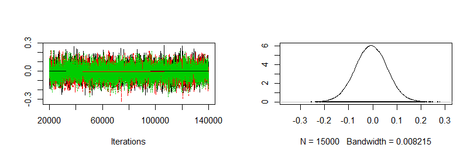
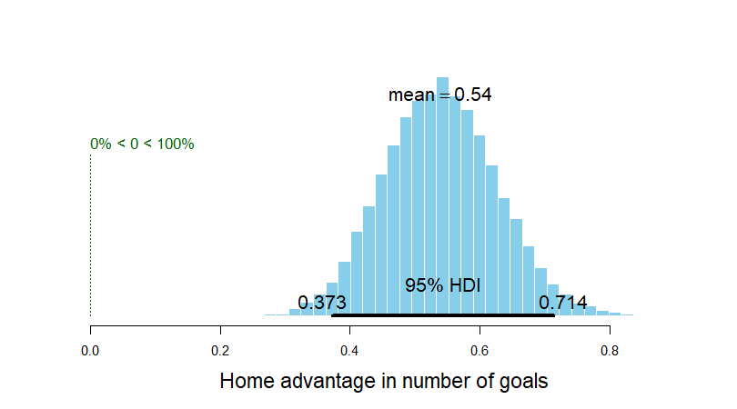
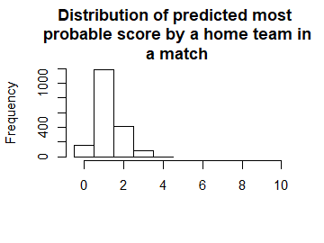
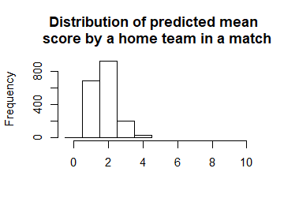
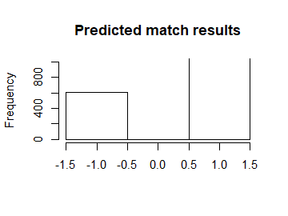
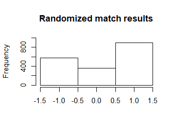
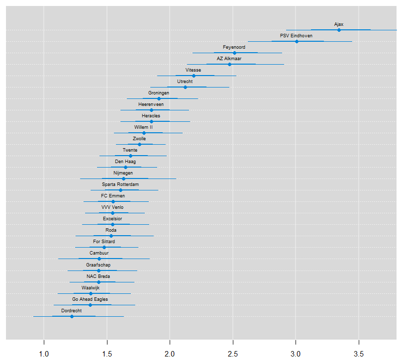
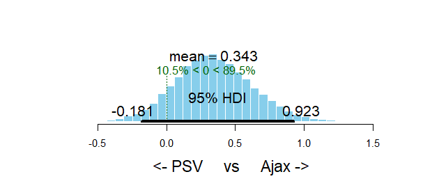
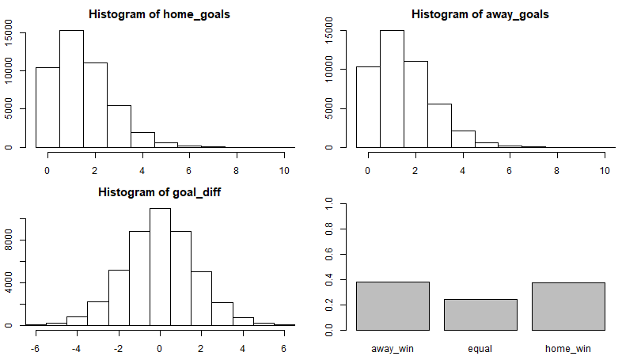

Bayesian estimation of a Poisson model for Dutch football matches odds
================
Piet Stam
August 28th, 2020

  - [Introduction](#introduction)
      - [Quick summary](#quick-summary)
      - [Acknowledgements](#acknowledgements)
  - [Data and methods](#data-and-methods)
      - [Theoretical description of the
        model](#theoretical-description-of-the-model)
          - [Basic model](#basic-model)
          - [General model](#general-model)
          - [Probabilistic Graphical
            Model](#probabilistic-graphical-model)
      - [Read data](#read-data)
  - [Estimation, simulation and
    validation](#estimation-simulation-and-validation)
      - [Model estimation](#model-estimation)
      - [Generating predictions (in- and
        out-of-sample)](#generating-predictions-in--and-out-of-sample)
      - [Model validation](#model-validation)
  - [Results](#results)
      - [The ranking of the teams](#the-ranking-of-the-teams)
      - [Predicting the future](#predicting-the-future)
      - [Betting on the match outcome](#betting-on-the-match-outcome)
      - [Betting on the correct score](#betting-on-the-correct-score)
      - [Betting results](#betting-results)
  - [Appendix](#appendix)
      - [Who do you call?](#who-do-you-call)

> *Copyright 2019 [Piet Stam](http://www.pietstam.nl). The code and the
> documentation are licensed under the Creative Commons [Attribution 4.0
> International license](http://creativecommons.org/licenses/by/4.0/).*

## Introduction

### Quick summary

We applied the original work of [Rasmus
Baath](http://www.sumsar.net/about.html) to the Dutch Eredivisie
football competition. With `r-bayesian-football-odds` we estimated the
odds of football matches in the last two weeks of the 2018/2019 Dutch
Eredivisie football competiton. We provide the code and evaluate the
results of our predictions.

### Acknowledgements

This piece of work is based on the works of [Rasmus
Baath](http://www.sumsar.net/blog/2013/07/modeling-match-results-in-la-liga-part-one/).
Rasmus Baath submitted his code to the [UseR 2013 data analysis
contest](https://www.r-project.org/conferences/useR-2013/) and licensed
it under the Creative Commons [Attribution 3.0 Unported
license](http://creativecommons.org/licenses/by/3.0/).

He predicted the results of the 50 last matches of the 2012/2013 Spanish
LaLiga season. He used data of the 2008/09-2012/13 seasons (5 seasons in
total) to estimate his regression model in a
[Bayesian](https://en.wikipedia.org/wiki/Bayes_estimator) way. See [this
thread](https://stats.stackexchange.com/questions/252577/bayes-regression-how-is-it-done-in-comparison-to-standard-regression)
for an intuitive explanation of the difference between the bayesian
approach and the conventional approaches of linear regression and
maximum likelihood.

I slightly adpated his code to predict the results of the last two
competition rounds (that is, the last 18 matches) of the 2018/2019 Dutch
Eredivisie season. These predictions are based on soccer match data of
the 2014/15-2018/19 seasons (5 seasons in total). The source of these
data is [here](http://www.football-data.co.uk/netherlandsm.php). Out of
the three model specifications that Rasmus developed, I used the most
sophisticated model that allowed for year-to-year variability in team
skill (called “iteration 3” by Rasmus).

You can find my code at
[GitHub](https://github.com/pjastam/r-bayesian-football-odds). Rasmus
deserves all the credits, I deserve all the blame in case of any errors
in my application to the Dutch football competition.

## Data and methods

### Theoretical description of the model

<!-- The source of the folowing function is  [https://github.com/STAT545-UBC/Discussion/issues/102](https://github.com/STAT545-UBC/Discussion/issues/102). -->

#### Basic model

The first thing to notice is that not all teams are equally good.
Therefore, it will be assumed that all teams have a latent skill
variable and the skill of a team *minus* the skill of the opposing team
defines the predicted outcome of a game. As the number of goals are
assumed to be Poisson distributed it is natural that the skills of the
teams are on the log scale of the mean of the distribution.

In its simplest form, the distribution of the number of goals for team
\(i\) when facing team \(j\) is then

)

%20%3D%20%5Ctext%7Bbaseline%7D%20+%20%5Ctext%7Bskill%7D_i%20-%20%5Ctext%7Bskill%7D_j)

where <code>baseline</code> is the log average number of goals when both
teams are equally good. Note that this model description does not
capture the variation in the number of goals among football seasons and
between home vs away teams.

#### General model

In order to allow for variation in the number of goals among football
seasons and between home vs away teams, we refine the distribution of
the goal outcome of a match between home team \(i\) and away team \(j\)
in season \(s\) as follows:

)

with the <code>lambdas</code> defined as follows

)

)

Note that the <code>baseline</code> is split into
<code>home\_baseline</code> and <code>away\_baseline</code> in order to
account for the home advantage. Furthermore, we introduced the index t
for the baseline and skill parameters to allow for variation among
seasons.

##### Defining the baseline distributions

I set the prior distributions of the baselines in season \(s\) to:

)

)

and in the *first* season to:

)

)

with <code>sigma-seasons</code> defined as:

)

##### Defining the team skill distributions

I set the prior distributions over the skills of team \(i\) (or \(j\),
denoted as i|j) in season \(s\) to:

)

and in the *first* season to:

)

with the <code>sigma-seasons</code> defined as above and
<code>mu-teams</code> and <code>sigma-teams</code> defined as:

)

)

We apply a normalizing restriction with respect to the (arbitrarily
chosen) *first* team in each season \(s\) as follows


We choose very vague priors. For example, the prior on the baseline have
a SD of 4 but since this is on the log scale of the mean number of goals
it corresponds to one SD from the mean \(0\) covering the range of
\([0.02, 54.6]\) goals. A very wide prior indeed.

#### Probabilistic Graphical Model

We graphed the dependencies described above with the help of a
probabilistic graphical model. To this end, we make use of the CRAN
package
[DiagrammeR](https://cran.r-project.org/web/packages/DiagrammeR/index.html)
with the help of which you can use the [Graph Visualization
Software](https://graphviz.gitlab.io/).

<!-- -->

### Read data

We first read the Dutch soccer match data of the 2014/15-2018/19 Dutch
Eredivisie seasons from the original csv-files and cache them. The
result is a database called `eredivisie`.

``` r
from_year <- 2014
to_year <- 2020
source(paste0("functions/Import_Data_Eredivisie.R"))
```

Then the cached `eredivisie` data are cleaned and new variables are
created.

``` r
eredivisie <- eredivisie %>%
  mutate(MatchResult = sign(HomeGoals - AwayGoals)) # -1 Away win, 0 Draw, 1 Home win

# Creating a data frame d with only the complete match results
d <- na.omit(eredivisie)

# Lists with the unique names of all teams and all seasons in the database
teams <- unique(c(d$HomeTeam, d$AwayTeam))
seasons <- unique(d$Season)

# A list for JAGS with the data from d where the strings are coded as integers
data_list <- list(HomeGoals = d$HomeGoals, AwayGoals = d$AwayGoals, 
                  HomeTeam = as.numeric(factor(d$HomeTeam, levels=teams)),
                  AwayTeam = as.numeric(factor(d$AwayTeam, levels=teams)),
                  Season = as.numeric(factor(d$Season, levels=seasons)),
                  n_teams = length(teams), n_games = nrow(d), 
                  n_seasons = length(seasons))
```

The data set <code>eredivisie</code> contains data from 5 different
seasons. In this model we allow for variability in year-to-year team
performance. This variablitity in team performance can be demonstrated
by the following diagram, which shows that some teams do not even
participate in all seasons in the <code>eredivisie</code> data set, as a
result of dropping out of the first division:

``` r
qplot(Season, HomeTeam, data=d, ylab="Team", xlab = "Season")
```

<!-- -->

## Estimation, simulation and validation

### Model estimation

Turning this into a JAGS model results in the following string. Note
that the model loops over all seasons and all match results. JAGS
parameterizes the normal distribution with precision (the reciprocal of
the variance) instead of variance so the hyper priors have to be
converted. Finally, we "anchor" the skill of one team to a constant
otherwise the mean skill can drift away freely. Doing these adjustments
results in the following model description:

``` r
m3_string <- "model {
for(i in 1:n_games) {
HomeGoals[i] ~ dpois(lambda_home[Season[i], HomeTeam[i],AwayTeam[i]])
AwayGoals[i] ~ dpois(lambda_away[Season[i], HomeTeam[i],AwayTeam[i]])
}

for(season_i in 1:n_seasons) {
for(home_i in 1:n_teams) {
for(away_i in 1:n_teams) {
lambda_home[season_i, home_i, away_i] <- exp( home_baseline[season_i] + skill[season_i, home_i] - skill[season_i, away_i])
lambda_away[season_i, home_i, away_i] <- exp( away_baseline[season_i] + skill[season_i, away_i] - skill[season_i, home_i])
}
}
}

skill[1, 1] <- 0 
for(j in 2:n_teams) {
skill[1, j] ~ dnorm(group_skill, group_tau)
}

group_skill ~ dnorm(0, 0.0625)
group_tau <- 1/pow(group_sigma, 2)
group_sigma ~ dunif(0, 3)

home_baseline[1] ~ dnorm(0, 0.0625)
away_baseline[1] ~ dnorm(0, 0.0625)

for(season_i in 2:n_seasons) {
skill[season_i, 1] <- 0 
for(j in 2:n_teams) {
skill[season_i, j] ~ dnorm(skill[season_i - 1, j], season_tau)
}
home_baseline[season_i] ~ dnorm(home_baseline[season_i - 1], season_tau)
away_baseline[season_i] ~ dnorm(away_baseline[season_i - 1], season_tau)
}

season_tau <- 1/pow(season_sigma, 2) 
season_sigma ~ dunif(0, 3) 
}"
```

We then run this model directly from R using RJAGS and the
<code>textConnection</code> function. This takes about half an hour on
my computer, but of course this depends on the configuration at hand.

``` r
# Compiling the model
m3 <- run.jags(method="parallel",
               model=m3_string,
               monitor=c("home_baseline", "away_baseline","skill", "season_sigma", "group_sigma", "group_skill"),
               data=data_list,
               n.chains=3,
               adapt=10000,
               burnin=10000,
               sample=15000,
               thin=8,
               summarise=FALSE,
               plots=FALSE)
# Generating MCMC samples
s3 <- as.mcmc.list(m3)
# Merging the three MCMC chains into one matrix
ms3 <- as.matrix(s3)
```

The following graphs shows the trace plots and probability distributions
of the team mean, team sigma and season sigma parameters, respectively.

``` r
plot(s3[, "group_skill"])
```

<!-- -->

``` r
plot(s3[, "group_sigma"])
```

<!-- -->

``` r
plot(s3[, "season_sigma"])
```

<!-- -->

We can also calculate the default home advantage by looking at the
difference between <code>exp(home\_baseline) -
exp(away\_baseline)</code>. The next graph shows that there is a home
advantage of more than 0.4 goals, on average, and it differs
significantly from zero.

``` r
plotPost(exp(ms3[,col_name("home_baseline",to_year-from_year)]) - exp(ms3[,col_name("away_baseline",to_year-from_year)]), compVal = 0, xlab = "Home advantage in number of goals")
```

<!-- -->

    ##                                        mean    median     mode hdiMass
    ## Home advantage in number of goals 0.5398459 0.5387851 0.543352    0.95
    ##                                      hdiLow   hdiHigh compVal pcGTcompVal
    ## Home advantage in number of goals 0.3725848 0.7140152       0           1
    ##                                   ROPElow ROPEhigh pcInROPE
    ## Home advantage in number of goals      NA       NA       NA

### Generating predictions (in- and out-of-sample)

In the <code>eredivisie</code> data set included in this project, the
results of the 18 last games of the 2018/2019 season are missing. Using
our model we can now both predict and simulate the outcomes of these 18
games. The R code below calculates a number of measures for each game
(both the games with known and unknown outcomes):

  - The mode of the simulated number of goals, that is, the *most
    likely* number of scored goals. If we were asked to bet on the
    number of goals in a game this is what we would use.
  - The mean of the simulated number of goals, this is our best guess of
    the average number of goals in a game.
  - The most likely match result for each game.
  - A random sample from the distributions of credible home scores, away
    scores and match results. This is how the Eredivisie actually could
    have played out in an alternative reality.

<!-- end list -->

``` r
n <- nrow(ms3)
m3_pred <- sapply(1:nrow(eredivisie), function(i) {
  home_team <- which(teams == eredivisie$HomeTeam[i])
  away_team <- which(teams == eredivisie$AwayTeam[i])
  season <- which(seasons == eredivisie$Season[i])
  home_skill <- ms3[, col_name("skill", season, home_team)] 
  away_skill <- ms3[, col_name("skill", season, away_team)]
  home_baseline <- ms3[, col_name("home_baseline", season)]
  away_baseline <- ms3[, col_name("away_baseline", season)]
  
  home_goals <- rpois(n, exp(home_baseline + home_skill - away_skill))
  away_goals <- rpois(n, exp(away_baseline + away_skill - home_skill))
  home_goals_table <- table(home_goals)
  away_goals_table <- table(away_goals)
  match_results <- sign(home_goals - away_goals)
  match_results_table <- table(match_results)
  
  mode_home_goal <- as.numeric(names(home_goals_table)[ which.max(home_goals_table)])
  mode_away_goal <- as.numeric(names(away_goals_table)[ which.max(away_goals_table)])
  match_result <-  as.numeric(names(match_results_table)[which.max(match_results_table)])
  rand_i <- sample(seq_along(home_goals), 1)
  
  c(mode_home_goal = mode_home_goal, mode_away_goal = mode_away_goal, match_result = match_result,
    mean_home_goal = mean(home_goals), mean_away_goal = mean(away_goals),
    rand_home_goal = home_goals[rand_i], rand_away_goal = away_goals[rand_i],
    rand_match_result = match_results[rand_i])
})
m3_pred <- t(m3_pred)
```

### Model validation

First let's compare the distribution of the actual number of goals in
the data with the predicted mode, mean and randomized number of goals
for all the games (focusing on the number of goals for the home team).

First the actual distribution of the number of goals for the home teams.

``` r
hist(eredivisie$HomeGoals, breaks= (-1:max(eredivisie$HomeGoals, na.rm=TRUE)) + 0.5, xlim=c(-0.5, 10), main = "Distribution of the number of goals\nscored by a home team in a match",
    xlab = "")
```

<!-- -->

This next plot shows the distribution of the modes from the predicted
distribution of home goals from each game. That is, what is the most
probable outcome, for the home team, in each game.

``` r
hist(m3_pred[ , "mode_home_goal"], breaks= (-1:max(m3_pred[ , "mode_home_goal"])) + 0.5, xlim=c(-0.5, 10),
    main = "Distribution of predicted most \nprobable score by a home team in\na match",
    xlab = "")
```

<!-- -->

For almost all games the single most likely number of goals is one.
Actually, if you know nothing about an Eredivisie game, betting on one
goal for the home team is 78 % of the times the best bet.

Let's instead look at the distribution of the predicted mean number of
home goals in each game.

``` r
hist(m3_pred[ , "mean_home_goal"], breaks= (-1:max(m3_pred[ , "mean_home_goal"])) + 0.5, xlim=c(-0.5, 10),
    main = "Distribution of predicted mean \n score by a home team in a match",
    xlab = "")
```

<!-- -->

For most games the expected number of goals are 2. That is, even if your
safest bet is one goal you would expect to see around two goals.

The distribution of the mode and the mean number of goals doesn’t look
remotely like the actual number of goals. This was not to be expected,
we would however expect the distribution of randomized goals (where for
each match the number of goals has been randomly drawn from that match’s
predicted home goal distribution) to look similar to the actual number
of home goals. Looking at the histogram below, this seems to be the
case.

``` r
hist(m3_pred[ , "rand_home_goal"], breaks= (-1:max(m3_pred[ , "rand_home_goal"])) + 0.5, xlim=c(-0.5, 10),
    main = "Distribution of randomly drawn \n score by a home team in a match",
    xlab = "")
```

<!-- -->

We can also look at how well the model predicts the data. This should
probably be done using cross validation, but as the number of effective
parameters are much smaller than the number of data points a direct
comparison should at least give an estimated prediction accuracy in the
right ballpark.

``` r
mean(eredivisie$HomeGoals == m3_pred[ , "mode_home_goal"], na.rm=T)
```

    ## [1] 0.3132804

``` r
mean((eredivisie$HomeGoals - m3_pred[ , "mean_home_goal"])^2, na.rm=T)
```

    ## [1] 1.547052

So on average the model predicts the correct number of home goals 31% of
the time and guesses the average number of goals with a mean squared
error of 1.51. Now we’ll look at the actual and predicted match
outcomes. The graph below shows the match outcomes in the data with 1
being a home win, 0 being a draw and -1 being a win for the away team.

``` r
hist(eredivisie$MatchResult, breaks= (-2:1) + 0.5, xlim=c(-1.5, 1.5), ylim=c(0, 1000), main = "Actual match results",
    xlab = "")
```

<!-- -->

Now looking at the most probable outcomes of the matches according to
the model.

``` r
hist(m3_pred[ , "match_result"], breaks= (-2:1) + 0.5, xlim=c(-1.5, 1.5), ylim=c(0, 1000), main = "Predicted match results",
    xlab = "")
```

<!-- -->

For almost all matches the safest bet is to bet on the home team. While
draws are not uncommon it is *never* the safest bet.

As in the case with the number of home goals, the randomized match
outcomes have a distribution similar to the actual match outcomes:

``` r
hist(m3_pred[ , "rand_match_result"], breaks= (-2:1) + 0.5, xlim=c(-1.5, 1.5), ylim=c(0, 1000), main = "Randomized match results",
    xlab = "")
```

<!-- -->

``` r
mean(eredivisie$MatchResult == m3_pred[ , "match_result"], na.rm=T)
```

    ## [1] 0.5646992

The model predicts the correct match outcome (i.e. home team wins / a
draw / away team wins) 57% of the time. Pretty good\!

## Results

Disclaimer: my comments below may be out of sync with the empirical
results and graphs, because these comments (as well as the description
of my betting experience in the last section) are based on the results
of running
[VERSION 1.0](https://github.com/pjastam/r-bayesian-football-odds/releases/tag/v1.0)
instead of the current version of the app.

### The ranking of the teams

We’ll start by ranking the teams of the <code>Eredivisie</code> using
the estimated skill parameters from the 2018/2019 season, which are
based on the estimation sample of the five seasons 2014/2015-2018/2019.
Note that for one of the teams the skill parameter is “anchored at
zero”. This “anchoring” is done for the very same "identification"
reason that one of the parameters in a traditional logit analysis is
always set to zero by default: the value of a parameter automatically
follows if you already know all the other parameters in your model and
given the fact that probabilities always sum up to 1 in total.

Consequently, as Rasmus noted before, the skill parameters are difficult
to interpret as they are relative to the skill of the team that had its
skill parameter “anchored” at zero. To put them on a more interpretable
scale the skill paramters are first zero centered by subtracting the
mean skill of all teams. Then he added the home baseline and
exponentiated the resulting values. These rescaled skill parameters are
now on the scale of expected number of goals when playing as a home
team.

``` r
team_skill <- ms3[, str_detect(string=colnames(ms3), paste0("skill\\[",to_year-from_year,","))]
team_skill <- (team_skill - rowMeans(team_skill)) + ms3[, paste0("home_baseline[",to_year-from_year,"]")]
team_skill <- exp(team_skill)
colnames(team_skill) <- teams
team_skill <- team_skill[,order(colMeans(team_skill), decreasing=T)]
old_par <- par(mar=c(2,0.7,0.7,0.7), xaxs='i')
caterplot(team_skill, labels.loc="above", val.lim=c(0.7, 3.8))
```

<!-- -->

``` r
par(old_par)
```

Two teams are clearly ahead of the rest, Ajax and PSV. Let's look at the
credible difference between these two teams. Ajax is a better team than
PSV with a probabilty of 74%, i.e. the odds in favor of Ajax are 74% /
26% = 3. So, on average, PSV only wins one out of four games that they
play against Ajax.

``` r
plotPost(team_skill[, "Ajax"] - team_skill[, "PSV Eindhoven"], compVal = 0, xlab = "<- PSV     vs     Ajax ->")
```

<!-- -->

    ##                                mean    median      mode hdiMass     hdiLow
    ## <- PSV     vs     Ajax -> 0.3432887 0.3327736 0.3145308    0.95 -0.1808036
    ##                             hdiHigh compVal pcGTcompVal ROPElow ROPEhigh
    ## <- PSV     vs     Ajax -> 0.9228638       0   0.8949778      NA       NA
    ##                           pcInROPE
    ## <- PSV     vs     Ajax ->       NA

### Predicting the future

Now that we’ve checked that the model reasonably predicts the Eredivisie
history let's predict the Eredivisie endgame\!

At the time when I executed my version of this model applied to the
Dutch Eredivisie competition (2019-05-10), most of the matches in the
2018/2019 season had already been played. Yet two out of 34 competition
rounds had to be played (that is, competition rounds 33 and 34). With
these two rounds still to go, Ajax and PSV both have 80 points, but Ajax
leads the competition as their goal difference is larger (111-30 = 81)
than that of PSV (95-24 = 71). The code below displays the predicted
mean and mode number of goals for the endgame and the predicted winner
of each game.

``` r
eredivisie_forecast <- eredivisie[is.na(eredivisie$HomeGoals), c("Season", "Week", "HomeTeam", "AwayTeam")]
m3_forecast <- m3_pred[is.na(eredivisie$HomeGoals),] 
eredivisie_forecast$mean_home_goals <- round(m3_forecast[,"mean_home_goal"], 1) 
eredivisie_forecast$mean_away_goals <- round(m3_forecast[,"mean_away_goal"], 1)
eredivisie_forecast$mode_home_goals <- m3_forecast[,"mode_home_goal"] 
eredivisie_forecast$mode_away_goals <- m3_forecast[,"mode_away_goal"]
eredivisie_forecast$predicted_winner <- ifelse(m3_forecast[ , "match_result"] == 1, eredivisie_forecast$HomeTeam, 
                                           ifelse(m3_forecast[ , "match_result"] == -1, eredivisie_forecast$AwayTeam, "Draw"))

rownames(eredivisie_forecast) <- NULL
print(xtable(eredivisie_forecast, align="cccccccccc"), type="html")
```

<!-- html table generated in R 3.6.1 by xtable 1.8-4 package -->

<!-- Fri Aug 28 14:44:38 2020 -->

<table border="1">

<tr>

<th>

</th>

<th>

Season

</th>

<th>

Week

</th>

<th>

HomeTeam

</th>

<th>

AwayTeam

</th>

<th>

mean\_home\_goals

</th>

<th>

mean\_away\_goals

</th>

<th>

mode\_home\_goals

</th>

<th>

mode\_away\_goals

</th>

<th>

predicted\_winner

</th>

</tr>

<tr>

<td align="center">

1

</td>

<td align="center">

2019/2020

</td>

<td align="center">

33

</td>

<td align="center">

Den Haag

</td>

<td align="center">

For Sittard

</td>

<td align="center">

2.00

</td>

<td align="center">

1.10

</td>

<td align="center">

1.00

</td>

<td align="center">

1.00

</td>

<td align="center">

Den Haag

</td>

</tr>

<tr>

<td align="center">

2

</td>

<td align="center">

2019/2020

</td>

<td align="center">

33

</td>

<td align="center">

Willem II

</td>

<td align="center">

Heerenveen

</td>

<td align="center">

1.70

</td>

<td align="center">

1.30

</td>

<td align="center">

1.00

</td>

<td align="center">

1.00

</td>

<td align="center">

Willem II

</td>

</tr>

<tr>

<td align="center">

3

</td>

<td align="center">

2019/2020

</td>

<td align="center">

33

</td>

<td align="center">

Ajax

</td>

<td align="center">

Twente

</td>

<td align="center">

3.50

</td>

<td align="center">

0.60

</td>

<td align="center">

3.00

</td>

<td align="center">

0.00

</td>

<td align="center">

Ajax

</td>

</tr>

<tr>

<td align="center">

4

</td>

<td align="center">

2019/2020

</td>

<td align="center">

33

</td>

<td align="center">

Utrecht

</td>

<td align="center">

Vitesse

</td>

<td align="center">

1.70

</td>

<td align="center">

1.30

</td>

<td align="center">

1.00

</td>

<td align="center">

1.00

</td>

<td align="center">

Utrecht

</td>

</tr>

<tr>

<td align="center">

5

</td>

<td align="center">

2019/2020

</td>

<td align="center">

33

</td>

<td align="center">

Zwolle

</td>

<td align="center">

Heracles

</td>

<td align="center">

1.70

</td>

<td align="center">

1.30

</td>

<td align="center">

1.00

</td>

<td align="center">

1.00

</td>

<td align="center">

Zwolle

</td>

</tr>

<tr>

<td align="center">

6

</td>

<td align="center">

2019/2020

</td>

<td align="center">

33

</td>

<td align="center">

Sparta Rotterdam

</td>

<td align="center">

Feyenoord

</td>

<td align="center">

1.10

</td>

<td align="center">

1.90

</td>

<td align="center">

1.00

</td>

<td align="center">

1.00

</td>

<td align="center">

Feyenoord

</td>

</tr>

<tr>

<td align="center">

7

</td>

<td align="center">

2019/2020

</td>

<td align="center">

33

</td>

<td align="center">

PSV Eindhoven

</td>

<td align="center">

FC Emmen

</td>

<td align="center">

3.40

</td>

<td align="center">

0.60

</td>

<td align="center">

3.00

</td>

<td align="center">

0.00

</td>

<td align="center">

PSV Eindhoven

</td>

</tr>

<tr>

<td align="center">

8

</td>

<td align="center">

2019/2020

</td>

<td align="center">

33

</td>

<td align="center">

VVV Venlo

</td>

<td align="center">

AZ Alkmaar

</td>

<td align="center">

1.10

</td>

<td align="center">

2.00

</td>

<td align="center">

1.00

</td>

<td align="center">

1.00

</td>

<td align="center">

AZ Alkmaar

</td>

</tr>

<tr>

<td align="center">

9

</td>

<td align="center">

2019/2020

</td>

<td align="center">

33

</td>

<td align="center">

Waalwijk

</td>

<td align="center">

Groningen

</td>

<td align="center">

1.30

</td>

<td align="center">

1.70

</td>

<td align="center">

1.00

</td>

<td align="center">

1.00

</td>

<td align="center">

Groningen

</td>

</tr>

<tr>

<td align="center">

10

</td>

<td align="center">

2019/2020

</td>

<td align="center">

34

</td>

<td align="center">

Heracles

</td>

<td align="center">

Sparta Rotterdam

</td>

<td align="center">

2.00

</td>

<td align="center">

1.10

</td>

<td align="center">

1.00

</td>

<td align="center">

1.00

</td>

<td align="center">

Heracles

</td>

</tr>

<tr>

<td align="center">

11

</td>

<td align="center">

2019/2020

</td>

<td align="center">

34

</td>

<td align="center">

Twente

</td>

<td align="center">

Den Haag

</td>

<td align="center">

1.80

</td>

<td align="center">

1.20

</td>

<td align="center">

1.00

</td>

<td align="center">

1.00

</td>

<td align="center">

Twente

</td>

</tr>

<tr>

<td align="center">

12

</td>

<td align="center">

2019/2020

</td>

<td align="center">

34

</td>

<td align="center">

Vitesse

</td>

<td align="center">

Willem II

</td>

<td align="center">

2.20

</td>

<td align="center">

1.00

</td>

<td align="center">

2.00

</td>

<td align="center">

1.00

</td>

<td align="center">

Vitesse

</td>

</tr>

<tr>

<td align="center">

13

</td>

<td align="center">

2019/2020

</td>

<td align="center">

34

</td>

<td align="center">

Zwolle

</td>

<td align="center">

VVV Venlo

</td>

<td align="center">

2.00

</td>

<td align="center">

1.10

</td>

<td align="center">

2.00

</td>

<td align="center">

1.00

</td>

<td align="center">

Zwolle

</td>

</tr>

<tr>

<td align="center">

14

</td>

<td align="center">

2019/2020

</td>

<td align="center">

34

</td>

<td align="center">

Heerenveen

</td>

<td align="center">

Waalwijk

</td>

<td align="center">

2.40

</td>

<td align="center">

0.90

</td>

<td align="center">

2.00

</td>

<td align="center">

0.00

</td>

<td align="center">

Heerenveen

</td>

</tr>

<tr>

<td align="center">

15

</td>

<td align="center">

2019/2020

</td>

<td align="center">

34

</td>

<td align="center">

For Sittard

</td>

<td align="center">

PSV Eindhoven

</td>

<td align="center">

0.90

</td>

<td align="center">

2.50

</td>

<td align="center">

0.00

</td>

<td align="center">

2.00

</td>

<td align="center">

PSV Eindhoven

</td>

</tr>

<tr>

<td align="center">

16

</td>

<td align="center">

2019/2020

</td>

<td align="center">

34

</td>

<td align="center">

Feyenoord

</td>

<td align="center">

Ajax

</td>

<td align="center">

1.30

</td>

<td align="center">

1.60

</td>

<td align="center">

1.00

</td>

<td align="center">

1.00

</td>

<td align="center">

Ajax

</td>

</tr>

<tr>

<td align="center">

17

</td>

<td align="center">

2019/2020

</td>

<td align="center">

34

</td>

<td align="center">

Groningen

</td>

<td align="center">

AZ Alkmaar

</td>

<td align="center">

1.40

</td>

<td align="center">

1.60

</td>

<td align="center">

1.00

</td>

<td align="center">

1.00

</td>

<td align="center">

AZ Alkmaar

</td>

</tr>

<tr>

<td align="center">

18

</td>

<td align="center">

2019/2020

</td>

<td align="center">

34

</td>

<td align="center">

FC Emmen

</td>

<td align="center">

Utrecht

</td>

<td align="center">

1.30

</td>

<td align="center">

1.70

</td>

<td align="center">

1.00

</td>

<td align="center">

1.00

</td>

<td align="center">

Utrecht

</td>

</tr>

<tr>

<td align="center">

19

</td>

<td align="center">

2019/2020

</td>

<td align="center">

36

</td>

<td align="center">

Sparta Rotterdam

</td>

<td align="center">

Heerenveen

</td>

<td align="center">

1.50

</td>

<td align="center">

1.40

</td>

<td align="center">

1.00

</td>

<td align="center">

1.00

</td>

<td align="center">

Sparta Rotterdam

</td>

</tr>

<tr>

<td align="center">

20

</td>

<td align="center">

2019/2020

</td>

<td align="center">

36

</td>

<td align="center">

VVV Venlo

</td>

<td align="center">

Willem II

</td>

<td align="center">

1.50

</td>

<td align="center">

1.40

</td>

<td align="center">

1.00

</td>

<td align="center">

1.00

</td>

<td align="center">

VVV Venlo

</td>

</tr>

<tr>

<td align="center">

21

</td>

<td align="center">

2019/2020

</td>

<td align="center">

36

</td>

<td align="center">

PSV Eindhoven

</td>

<td align="center">

Heracles

</td>

<td align="center">

2.90

</td>

<td align="center">

0.80

</td>

<td align="center">

2.00

</td>

<td align="center">

0.00

</td>

<td align="center">

PSV Eindhoven

</td>

</tr>

<tr>

<td align="center">

22

</td>

<td align="center">

2019/2020

</td>

<td align="center">

36

</td>

<td align="center">

AZ Alkmaar

</td>

<td align="center">

Vitesse

</td>

<td align="center">

2.00

</td>

<td align="center">

1.10

</td>

<td align="center">

1.00

</td>

<td align="center">

1.00

</td>

<td align="center">

AZ Alkmaar

</td>

</tr>

<tr>

<td align="center">

23

</td>

<td align="center">

2019/2020

</td>

<td align="center">

36

</td>

<td align="center">

Utrecht

</td>

<td align="center">

Groningen

</td>

<td align="center">

2.00

</td>

<td align="center">

1.10

</td>

<td align="center">

1.00

</td>

<td align="center">

1.00

</td>

<td align="center">

Utrecht

</td>

</tr>

<tr>

<td align="center">

24

</td>

<td align="center">

2019/2020

</td>

<td align="center">

36

</td>

<td align="center">

Waalwijk

</td>

<td align="center">

Feyenoord

</td>

<td align="center">

1.00

</td>

<td align="center">

2.20

</td>

<td align="center">

0.00

</td>

<td align="center">

2.00

</td>

<td align="center">

Feyenoord

</td>

</tr>

<tr>

<td align="center">

25

</td>

<td align="center">

2019/2020

</td>

<td align="center">

36

</td>

<td align="center">

Ajax

</td>

<td align="center">

Zwolle

</td>

<td align="center">

3.30

</td>

<td align="center">

0.60

</td>

<td align="center">

3.00

</td>

<td align="center">

0.00

</td>

<td align="center">

Ajax

</td>

</tr>

<tr>

<td align="center">

26

</td>

<td align="center">

2019/2020

</td>

<td align="center">

36

</td>

<td align="center">

Den Haag

</td>

<td align="center">

FC Emmen

</td>

<td align="center">

1.90

</td>

<td align="center">

1.20

</td>

<td align="center">

1.00

</td>

<td align="center">

1.00

</td>

<td align="center">

Den Haag

</td>

</tr>

<tr>

<td align="center">

27

</td>

<td align="center">

2019/2020

</td>

<td align="center">

36

</td>

<td align="center">

Twente

</td>

<td align="center">

For Sittard

</td>

<td align="center">

2.00

</td>

<td align="center">

1.10

</td>

<td align="center">

1.00

</td>

<td align="center">

1.00

</td>

<td align="center">

Twente

</td>

</tr>

<tr>

<td align="center">

28

</td>

<td align="center">

2019/2020

</td>

<td align="center">

36

</td>

<td align="center">

Utrecht

</td>

<td align="center">

Ajax

</td>

<td align="center">

1.10

</td>

<td align="center">

1.90

</td>

<td align="center">

1.00

</td>

<td align="center">

1.00

</td>

<td align="center">

Ajax

</td>

</tr>

<tr>

<td align="center">

29

</td>

<td align="center">

2019/2020

</td>

<td align="center">

36

</td>

<td align="center">

AZ Alkmaar

</td>

<td align="center">

Feyenoord

</td>

<td align="center">

1.80

</td>

<td align="center">

1.20

</td>

<td align="center">

1.00

</td>

<td align="center">

1.00

</td>

<td align="center">

AZ Alkmaar

</td>

</tr>

<tr>

<td align="center">

30

</td>

<td align="center">

2019/2020

</td>

<td align="center">

37

</td>

<td align="center">

Groningen

</td>

<td align="center">

Heerenveen

</td>

<td align="center">

1.80

</td>

<td align="center">

1.20

</td>

<td align="center">

1.00

</td>

<td align="center">

1.00

</td>

<td align="center">

Groningen

</td>

</tr>

<tr>

<td align="center">

31

</td>

<td align="center">

2019/2020

</td>

<td align="center">

37

</td>

<td align="center">

Vitesse

</td>

<td align="center">

Waalwijk

</td>

<td align="center">

2.80

</td>

<td align="center">

0.80

</td>

<td align="center">

2.00

</td>

<td align="center">

0.00

</td>

<td align="center">

Vitesse

</td>

</tr>

<tr>

<td align="center">

32

</td>

<td align="center">

2019/2020

</td>

<td align="center">

37

</td>

<td align="center">

Feyenoord

</td>

<td align="center">

VVV Venlo

</td>

<td align="center">

2.90

</td>

<td align="center">

0.80

</td>

<td align="center">

2.00

</td>

<td align="center">

0.00

</td>

<td align="center">

Feyenoord

</td>

</tr>

<tr>

<td align="center">

33

</td>

<td align="center">

2019/2020

</td>

<td align="center">

37

</td>

<td align="center">

Heracles

</td>

<td align="center">

AZ Alkmaar

</td>

<td align="center">

1.30

</td>

<td align="center">

1.60

</td>

<td align="center">

1.00

</td>

<td align="center">

1.00

</td>

<td align="center">

AZ Alkmaar

</td>

</tr>

<tr>

<td align="center">

34

</td>

<td align="center">

2019/2020

</td>

<td align="center">

37

</td>

<td align="center">

Willem II

</td>

<td align="center">

Den Haag

</td>

<td align="center">

1.90

</td>

<td align="center">

1.10

</td>

<td align="center">

1.00

</td>

<td align="center">

1.00

</td>

<td align="center">

Willem II

</td>

</tr>

<tr>

<td align="center">

35

</td>

<td align="center">

2019/2020

</td>

<td align="center">

37

</td>

<td align="center">

For Sittard

</td>

<td align="center">

Utrecht

</td>

<td align="center">

1.20

</td>

<td align="center">

1.80

</td>

<td align="center">

1.00

</td>

<td align="center">

1.00

</td>

<td align="center">

Utrecht

</td>

</tr>

<tr>

<td align="center">

36

</td>

<td align="center">

2019/2020

</td>

<td align="center">

37

</td>

<td align="center">

FC Emmen

</td>

<td align="center">

Ajax

</td>

<td align="center">

0.80

</td>

<td align="center">

2.70

</td>

<td align="center">

0.00

</td>

<td align="center">

2.00

</td>

<td align="center">

Ajax

</td>

</tr>

<tr>

<td align="center">

37

</td>

<td align="center">

2019/2020

</td>

<td align="center">

37

</td>

<td align="center">

Zwolle

</td>

<td align="center">

Twente

</td>

<td align="center">

1.80

</td>

<td align="center">

1.20

</td>

<td align="center">

1.00

</td>

<td align="center">

1.00

</td>

<td align="center">

Zwolle

</td>

</tr>

<tr>

<td align="center">

38

</td>

<td align="center">

2019/2020

</td>

<td align="center">

37

</td>

<td align="center">

PSV Eindhoven

</td>

<td align="center">

Sparta Rotterdam

</td>

<td align="center">

3.30

</td>

<td align="center">

0.70

</td>

<td align="center">

3.00

</td>

<td align="center">

0.00

</td>

<td align="center">

PSV Eindhoven

</td>

</tr>

<tr>

<td align="center">

39

</td>

<td align="center">

2019/2020

</td>

<td align="center">

38

</td>

<td align="center">

AZ Alkmaar

</td>

<td align="center">

PSV Eindhoven

</td>

<td align="center">

1.50

</td>

<td align="center">

1.50

</td>

<td align="center">

1.00

</td>

<td align="center">

1.00

</td>

<td align="center">

PSV Eindhoven

</td>

</tr>

<tr>

<td align="center">

40

</td>

<td align="center">

2019/2020

</td>

<td align="center">

38

</td>

<td align="center">

Sparta Rotterdam

</td>

<td align="center">

Zwolle

</td>

<td align="center">

1.60

</td>

<td align="center">

1.30

</td>

<td align="center">

1.00

</td>

<td align="center">

1.00

</td>

<td align="center">

Sparta Rotterdam

</td>

</tr>

<tr>

<td align="center">

41

</td>

<td align="center">

2019/2020

</td>

<td align="center">

38

</td>

<td align="center">

Den Haag

</td>

<td align="center">

Feyenoord

</td>

<td align="center">

1.20

</td>

<td align="center">

1.90

</td>

<td align="center">

1.00

</td>

<td align="center">

1.00

</td>

<td align="center">

Feyenoord

</td>

</tr>

<tr>

<td align="center">

42

</td>

<td align="center">

2019/2020

</td>

<td align="center">

38

</td>

<td align="center">

Waalwijk

</td>

<td align="center">

Willem II

</td>

<td align="center">

1.40

</td>

<td align="center">

1.60

</td>

<td align="center">

1.00

</td>

<td align="center">

1.00

</td>

<td align="center">

Willem II

</td>

</tr>

<tr>

<td align="center">

43

</td>

<td align="center">

2019/2020

</td>

<td align="center">

38

</td>

<td align="center">

Groningen

</td>

<td align="center">

For Sittard

</td>

<td align="center">

2.30

</td>

<td align="center">

0.90

</td>

<td align="center">

2.00

</td>

<td align="center">

0.00

</td>

<td align="center">

Groningen

</td>

</tr>

<tr>

<td align="center">

44

</td>

<td align="center">

2019/2020

</td>

<td align="center">

38

</td>

<td align="center">

Heerenveen

</td>

<td align="center">

FC Emmen

</td>

<td align="center">

2.10

</td>

<td align="center">

1.00

</td>

<td align="center">

2.00

</td>

<td align="center">

1.00

</td>

<td align="center">

Heerenveen

</td>

</tr>

<tr>

<td align="center">

45

</td>

<td align="center">

2019/2020

</td>

<td align="center">

38

</td>

<td align="center">

Utrecht

</td>

<td align="center">

Heracles

</td>

<td align="center">

2.00

</td>

<td align="center">

1.10

</td>

<td align="center">

1.00

</td>

<td align="center">

1.00

</td>

<td align="center">

Utrecht

</td>

</tr>

<tr>

<td align="center">

46

</td>

<td align="center">

2019/2020

</td>

<td align="center">

38

</td>

<td align="center">

Twente

</td>

<td align="center">

VVV Venlo

</td>

<td align="center">

1.90

</td>

<td align="center">

1.10

</td>

<td align="center">

1.00

</td>

<td align="center">

1.00

</td>

<td align="center">

Twente

</td>

</tr>

<tr>

<td align="center">

47

</td>

<td align="center">

2019/2020

</td>

<td align="center">

38

</td>

<td align="center">

Ajax

</td>

<td align="center">

Vitesse

</td>

<td align="center">

2.70

</td>

<td align="center">

0.80

</td>

<td align="center">

2.00

</td>

<td align="center">

0.00

</td>

<td align="center">

Ajax

</td>

</tr>

<tr>

<td align="center">

48

</td>

<td align="center">

2019/2020

</td>

<td align="center">

39

</td>

<td align="center">

PSV Eindhoven

</td>

<td align="center">

Utrecht

</td>

<td align="center">

2.50

</td>

<td align="center">

0.90

</td>

<td align="center">

2.00

</td>

<td align="center">

0.00

</td>

<td align="center">

PSV Eindhoven

</td>

</tr>

<tr>

<td align="center">

49

</td>

<td align="center">

2019/2020

</td>

<td align="center">

39

</td>

<td align="center">

For Sittard

</td>

<td align="center">

AZ Alkmaar

</td>

<td align="center">

1.10

</td>

<td align="center">

2.10

</td>

<td align="center">

1.00

</td>

<td align="center">

2.00

</td>

<td align="center">

AZ Alkmaar

</td>

</tr>

<tr>

<td align="center">

50

</td>

<td align="center">

2019/2020

</td>

<td align="center">

39

</td>

<td align="center">

FC Emmen

</td>

<td align="center">

Waalwijk

</td>

<td align="center">

2.00

</td>

<td align="center">

1.10

</td>

<td align="center">

1.00

</td>

<td align="center">

1.00

</td>

<td align="center">

FC Emmen

</td>

</tr>

<tr>

<td align="center">

51

</td>

<td align="center">

2019/2020

</td>

<td align="center">

39

</td>

<td align="center">

Feyenoord

</td>

<td align="center">

Groningen

</td>

<td align="center">

2.30

</td>

<td align="center">

0.90

</td>

<td align="center">

2.00

</td>

<td align="center">

0.00

</td>

<td align="center">

Feyenoord

</td>

</tr>

<tr>

<td align="center">

52

</td>

<td align="center">

2019/2020

</td>

<td align="center">

39

</td>

<td align="center">

Zwolle

</td>

<td align="center">

Heerenveen

</td>

<td align="center">

1.70

</td>

<td align="center">

1.30

</td>

<td align="center">

1.00

</td>

<td align="center">

1.00

</td>

<td align="center">

Zwolle

</td>

</tr>

<tr>

<td align="center">

53

</td>

<td align="center">

2019/2020

</td>

<td align="center">

39

</td>

<td align="center">

Heracles

</td>

<td align="center">

Twente

</td>

<td align="center">

1.90

</td>

<td align="center">

1.10

</td>

<td align="center">

1.00

</td>

<td align="center">

1.00

</td>

<td align="center">

Heracles

</td>

</tr>

<tr>

<td align="center">

54

</td>

<td align="center">

2019/2020

</td>

<td align="center">

39

</td>

<td align="center">

VVV Venlo

</td>

<td align="center">

Den Haag

</td>

<td align="center">

1.70

</td>

<td align="center">

1.30

</td>

<td align="center">

1.00

</td>

<td align="center">

1.00

</td>

<td align="center">

VVV Venlo

</td>

</tr>

<tr>

<td align="center">

55

</td>

<td align="center">

2019/2020

</td>

<td align="center">

39

</td>

<td align="center">

Willem II

</td>

<td align="center">

Ajax

</td>

<td align="center">

1.00

</td>

<td align="center">

2.30

</td>

<td align="center">

0.00

</td>

<td align="center">

2.00

</td>

<td align="center">

Ajax

</td>

</tr>

<tr>

<td align="center">

56

</td>

<td align="center">

2019/2020

</td>

<td align="center">

39

</td>

<td align="center">

Vitesse

</td>

<td align="center">

Sparta Rotterdam

</td>

<td align="center">

2.40

</td>

<td align="center">

0.90

</td>

<td align="center">

2.00

</td>

<td align="center">

0.00

</td>

<td align="center">

Vitesse

</td>

</tr>

<tr>

<td align="center">

57

</td>

<td align="center">

2019/2020

</td>

<td align="center">

40

</td>

<td align="center">

Ajax

</td>

<td align="center">

VVV Venlo

</td>

<td align="center">

3.80

</td>

<td align="center">

0.60

</td>

<td align="center">

3.00

</td>

<td align="center">

0.00

</td>

<td align="center">

Ajax

</td>

</tr>

<tr>

<td align="center">

58

</td>

<td align="center">

2019/2020

</td>

<td align="center">

40

</td>

<td align="center">

AZ Alkmaar

</td>

<td align="center">

Utrecht

</td>

<td align="center">

2.10

</td>

<td align="center">

1.10

</td>

<td align="center">

2.00

</td>

<td align="center">

1.00

</td>

<td align="center">

AZ Alkmaar

</td>

</tr>

<tr>

<td align="center">

59

</td>

<td align="center">

2019/2020

</td>

<td align="center">

40

</td>

<td align="center">

Groningen

</td>

<td align="center">

Den Haag

</td>

<td align="center">

2.10

</td>

<td align="center">

1.10

</td>

<td align="center">

2.00

</td>

<td align="center">

1.00

</td>

<td align="center">

Groningen

</td>

</tr>

<tr>

<td align="center">

60

</td>

<td align="center">

2019/2020

</td>

<td align="center">

40

</td>

<td align="center">

Heerenveen

</td>

<td align="center">

PSV Eindhoven

</td>

<td align="center">

1.10

</td>

<td align="center">

2.00

</td>

<td align="center">

1.00

</td>

<td align="center">

1.00

</td>

<td align="center">

PSV Eindhoven

</td>

</tr>

<tr>

<td align="center">

61

</td>

<td align="center">

2019/2020

</td>

<td align="center">

40

</td>

<td align="center">

Sparta Rotterdam

</td>

<td align="center">

Willem II

</td>

<td align="center">

1.60

</td>

<td align="center">

1.40

</td>

<td align="center">

1.00

</td>

<td align="center">

1.00

</td>

<td align="center">

Sparta Rotterdam

</td>

</tr>

<tr>

<td align="center">

62

</td>

<td align="center">

2019/2020

</td>

<td align="center">

40

</td>

<td align="center">

Twente

</td>

<td align="center">

Feyenoord

</td>

<td align="center">

1.20

</td>

<td align="center">

1.80

</td>

<td align="center">

1.00

</td>

<td align="center">

1.00

</td>

<td align="center">

Feyenoord

</td>

</tr>

<tr>

<td align="center">

63

</td>

<td align="center">

2019/2020

</td>

<td align="center">

40

</td>

<td align="center">

Vitesse

</td>

<td align="center">

Heracles

</td>

<td align="center">

2.10

</td>

<td align="center">

1.00

</td>

<td align="center">

2.00

</td>

<td align="center">

1.00

</td>

<td align="center">

Vitesse

</td>

</tr>

<tr>

<td align="center">

64

</td>

<td align="center">

2019/2020

</td>

<td align="center">

40

</td>

<td align="center">

Waalwijk

</td>

<td align="center">

For Sittard

</td>

<td align="center">

1.60

</td>

<td align="center">

1.30

</td>

<td align="center">

1.00

</td>

<td align="center">

1.00

</td>

<td align="center">

Waalwijk

</td>

</tr>

<tr>

<td align="center">

65

</td>

<td align="center">

2019/2020

</td>

<td align="center">

40

</td>

<td align="center">

Zwolle

</td>

<td align="center">

FC Emmen

</td>

<td align="center">

2.00

</td>

<td align="center">

1.10

</td>

<td align="center">

1.00

</td>

<td align="center">

1.00

</td>

<td align="center">

Zwolle

</td>

</tr>

<tr>

<td align="center">

66

</td>

<td align="center">

2019/2020

</td>

<td align="center">

41

</td>

<td align="center">

Den Haag

</td>

<td align="center">

Zwolle

</td>

<td align="center">

1.60

</td>

<td align="center">

1.30

</td>

<td align="center">

1.00

</td>

<td align="center">

1.00

</td>

<td align="center">

Den Haag

</td>

</tr>

<tr>

<td align="center">

67

</td>

<td align="center">

2019/2020

</td>

<td align="center">

41

</td>

<td align="center">

FC Emmen

</td>

<td align="center">

AZ Alkmaar

</td>

<td align="center">

1.10

</td>

<td align="center">

2.00

</td>

<td align="center">

1.00

</td>

<td align="center">

1.00

</td>

<td align="center">

AZ Alkmaar

</td>

</tr>

<tr>

<td align="center">

68

</td>

<td align="center">

2019/2020

</td>

<td align="center">

41

</td>

<td align="center">

Feyenoord

</td>

<td align="center">

Vitesse

</td>

<td align="center">

2.00

</td>

<td align="center">

1.10

</td>

<td align="center">

2.00

</td>

<td align="center">

1.00

</td>

<td align="center">

Feyenoord

</td>

</tr>

<tr>

<td align="center">

69

</td>

<td align="center">

2019/2020

</td>

<td align="center">

41

</td>

<td align="center">

Heracles

</td>

<td align="center">

Groningen

</td>

<td align="center">

1.70

</td>

<td align="center">

1.30

</td>

<td align="center">

1.00

</td>

<td align="center">

1.00

</td>

<td align="center">

Heracles

</td>

</tr>

<tr>

<td align="center">

70

</td>

<td align="center">

2019/2020

</td>

<td align="center">

41

</td>

<td align="center">

PSV Eindhoven

</td>

<td align="center">

Waalwijk

</td>

<td align="center">

3.90

</td>

<td align="center">

0.60

</td>

<td align="center">

3.00

</td>

<td align="center">

0.00

</td>

<td align="center">

PSV Eindhoven

</td>

</tr>

<tr>

<td align="center">

71

</td>

<td align="center">

2019/2020

</td>

<td align="center">

41

</td>

<td align="center">

For Sittard

</td>

<td align="center">

Ajax

</td>

<td align="center">

0.80

</td>

<td align="center">

2.80

</td>

<td align="center">

0.00

</td>

<td align="center">

2.00

</td>

<td align="center">

Ajax

</td>

</tr>

<tr>

<td align="center">

72

</td>

<td align="center">

2019/2020

</td>

<td align="center">

41

</td>

<td align="center">

Utrecht

</td>

<td align="center">

Heerenveen

</td>

<td align="center">

2.00

</td>

<td align="center">

1.10

</td>

<td align="center">

2.00

</td>

<td align="center">

1.00

</td>

<td align="center">

Utrecht

</td>

</tr>

<tr>

<td align="center">

73

</td>

<td align="center">

2019/2020

</td>

<td align="center">

41

</td>

<td align="center">

VVV Venlo

</td>

<td align="center">

Sparta Rotterdam

</td>

<td align="center">

1.70

</td>

<td align="center">

1.30

</td>

<td align="center">

1.00

</td>

<td align="center">

1.00

</td>

<td align="center">

VVV Venlo

</td>

</tr>

<tr>

<td align="center">

74

</td>

<td align="center">

2019/2020

</td>

<td align="center">

41

</td>

<td align="center">

Willem II

</td>

<td align="center">

Twente

</td>

<td align="center">

1.90

</td>

<td align="center">

1.20

</td>

<td align="center">

1.00

</td>

<td align="center">

1.00

</td>

<td align="center">

Willem II

</td>

</tr>

</table>

These predictions are perfectly useful if you want to bet on the likely
winner of each game. However, they do not reflect how the actual endgame
will play out, e.g., there is not a single draw in the
<code>predicted\_winner</code> column. So at last let's look at a
*possible* version of the Eredivisie endgame by displaying the simulated
match results calculated earlier.

``` r
eredivisie_sim <- eredivisie[is.na(eredivisie$HomeGoals), c("Season", "Week", "HomeTeam", "AwayTeam")]
eredivisie_sim$home_goals <- m3_forecast[,"rand_home_goal"] 
eredivisie_sim$away_goals <- m3_forecast[,"rand_away_goal"]
eredivisie_sim$winner <- ifelse(m3_forecast[ , "rand_match_result"] == 1, eredivisie_forecast$HomeTeam, 
                            ifelse(m3_forecast[ , "rand_match_result"] == -1, eredivisie_forecast$AwayTeam, "Draw"))

rownames(eredivisie_sim) <- NULL
print(xtable(eredivisie_sim, align="cccccccc"), type="html")
```

<!-- html table generated in R 3.6.1 by xtable 1.8-4 package -->

<!-- Fri Aug 28 14:44:39 2020 -->

<table border="1">

<tr>

<th>

</th>

<th>

Season

</th>

<th>

Week

</th>

<th>

HomeTeam

</th>

<th>

AwayTeam

</th>

<th>

home\_goals

</th>

<th>

away\_goals

</th>

<th>

winner

</th>

</tr>

<tr>

<td align="center">

1

</td>

<td align="center">

2019/2020

</td>

<td align="center">

33

</td>

<td align="center">

Den Haag

</td>

<td align="center">

For Sittard

</td>

<td align="center">

2.00

</td>

<td align="center">

1.00

</td>

<td align="center">

Den Haag

</td>

</tr>

<tr>

<td align="center">

2

</td>

<td align="center">

2019/2020

</td>

<td align="center">

33

</td>

<td align="center">

Willem II

</td>

<td align="center">

Heerenveen

</td>

<td align="center">

1.00

</td>

<td align="center">

4.00

</td>

<td align="center">

Heerenveen

</td>

</tr>

<tr>

<td align="center">

3

</td>

<td align="center">

2019/2020

</td>

<td align="center">

33

</td>

<td align="center">

Ajax

</td>

<td align="center">

Twente

</td>

<td align="center">

4.00

</td>

<td align="center">

1.00

</td>

<td align="center">

Ajax

</td>

</tr>

<tr>

<td align="center">

4

</td>

<td align="center">

2019/2020

</td>

<td align="center">

33

</td>

<td align="center">

Utrecht

</td>

<td align="center">

Vitesse

</td>

<td align="center">

1.00

</td>

<td align="center">

3.00

</td>

<td align="center">

Vitesse

</td>

</tr>

<tr>

<td align="center">

5

</td>

<td align="center">

2019/2020

</td>

<td align="center">

33

</td>

<td align="center">

Zwolle

</td>

<td align="center">

Heracles

</td>

<td align="center">

1.00

</td>

<td align="center">

0.00

</td>

<td align="center">

Zwolle

</td>

</tr>

<tr>

<td align="center">

6

</td>

<td align="center">

2019/2020

</td>

<td align="center">

33

</td>

<td align="center">

Sparta Rotterdam

</td>

<td align="center">

Feyenoord

</td>

<td align="center">

0.00

</td>

<td align="center">

1.00

</td>

<td align="center">

Feyenoord

</td>

</tr>

<tr>

<td align="center">

7

</td>

<td align="center">

2019/2020

</td>

<td align="center">

33

</td>

<td align="center">

PSV Eindhoven

</td>

<td align="center">

FC Emmen

</td>

<td align="center">

1.00

</td>

<td align="center">

1.00

</td>

<td align="center">

Draw

</td>

</tr>

<tr>

<td align="center">

8

</td>

<td align="center">

2019/2020

</td>

<td align="center">

33

</td>

<td align="center">

VVV Venlo

</td>

<td align="center">

AZ Alkmaar

</td>

<td align="center">

1.00

</td>

<td align="center">

3.00

</td>

<td align="center">

AZ Alkmaar

</td>

</tr>

<tr>

<td align="center">

9

</td>

<td align="center">

2019/2020

</td>

<td align="center">

33

</td>

<td align="center">

Waalwijk

</td>

<td align="center">

Groningen

</td>

<td align="center">

1.00

</td>

<td align="center">

1.00

</td>

<td align="center">

Draw

</td>

</tr>

<tr>

<td align="center">

10

</td>

<td align="center">

2019/2020

</td>

<td align="center">

34

</td>

<td align="center">

Heracles

</td>

<td align="center">

Sparta Rotterdam

</td>

<td align="center">

0.00

</td>

<td align="center">

2.00

</td>

<td align="center">

Sparta Rotterdam

</td>

</tr>

<tr>

<td align="center">

11

</td>

<td align="center">

2019/2020

</td>

<td align="center">

34

</td>

<td align="center">

Twente

</td>

<td align="center">

Den Haag

</td>

<td align="center">

3.00

</td>

<td align="center">

2.00

</td>

<td align="center">

Twente

</td>

</tr>

<tr>

<td align="center">

12

</td>

<td align="center">

2019/2020

</td>

<td align="center">

34

</td>

<td align="center">

Vitesse

</td>

<td align="center">

Willem II

</td>

<td align="center">

3.00

</td>

<td align="center">

1.00

</td>

<td align="center">

Vitesse

</td>

</tr>

<tr>

<td align="center">

13

</td>

<td align="center">

2019/2020

</td>

<td align="center">

34

</td>

<td align="center">

Zwolle

</td>

<td align="center">

VVV Venlo

</td>

<td align="center">

1.00

</td>

<td align="center">

2.00

</td>

<td align="center">

VVV Venlo

</td>

</tr>

<tr>

<td align="center">

14

</td>

<td align="center">

2019/2020

</td>

<td align="center">

34

</td>

<td align="center">

Heerenveen

</td>

<td align="center">

Waalwijk

</td>

<td align="center">

6.00

</td>

<td align="center">

1.00

</td>

<td align="center">

Heerenveen

</td>

</tr>

<tr>

<td align="center">

15

</td>

<td align="center">

2019/2020

</td>

<td align="center">

34

</td>

<td align="center">

For Sittard

</td>

<td align="center">

PSV Eindhoven

</td>

<td align="center">

0.00

</td>

<td align="center">

5.00

</td>

<td align="center">

PSV Eindhoven

</td>

</tr>

<tr>

<td align="center">

16

</td>

<td align="center">

2019/2020

</td>

<td align="center">

34

</td>

<td align="center">

Feyenoord

</td>

<td align="center">

Ajax

</td>

<td align="center">

1.00

</td>

<td align="center">

0.00

</td>

<td align="center">

Feyenoord

</td>

</tr>

<tr>

<td align="center">

17

</td>

<td align="center">

2019/2020

</td>

<td align="center">

34

</td>

<td align="center">

Groningen

</td>

<td align="center">

AZ Alkmaar

</td>

<td align="center">

1.00

</td>

<td align="center">

0.00

</td>

<td align="center">

Groningen

</td>

</tr>

<tr>

<td align="center">

18

</td>

<td align="center">

2019/2020

</td>

<td align="center">

34

</td>

<td align="center">

FC Emmen

</td>

<td align="center">

Utrecht

</td>

<td align="center">

0.00

</td>

<td align="center">

2.00

</td>

<td align="center">

Utrecht

</td>

</tr>

<tr>

<td align="center">

19

</td>

<td align="center">

2019/2020

</td>

<td align="center">

36

</td>

<td align="center">

Sparta Rotterdam

</td>

<td align="center">

Heerenveen

</td>

<td align="center">

1.00

</td>

<td align="center">

1.00

</td>

<td align="center">

Draw

</td>

</tr>

<tr>

<td align="center">

20

</td>

<td align="center">

2019/2020

</td>

<td align="center">

36

</td>

<td align="center">

VVV Venlo

</td>

<td align="center">

Willem II

</td>

<td align="center">

1.00

</td>

<td align="center">

1.00

</td>

<td align="center">

Draw

</td>

</tr>

<tr>

<td align="center">

21

</td>

<td align="center">

2019/2020

</td>

<td align="center">

36

</td>

<td align="center">

PSV Eindhoven

</td>

<td align="center">

Heracles

</td>

<td align="center">

3.00

</td>

<td align="center">

0.00

</td>

<td align="center">

PSV Eindhoven

</td>

</tr>

<tr>

<td align="center">

22

</td>

<td align="center">

2019/2020

</td>

<td align="center">

36

</td>

<td align="center">

AZ Alkmaar

</td>

<td align="center">

Vitesse

</td>

<td align="center">

1.00

</td>

<td align="center">

0.00

</td>

<td align="center">

AZ Alkmaar

</td>

</tr>

<tr>

<td align="center">

23

</td>

<td align="center">

2019/2020

</td>

<td align="center">

36

</td>

<td align="center">

Utrecht

</td>

<td align="center">

Groningen

</td>

<td align="center">

1.00

</td>

<td align="center">

0.00

</td>

<td align="center">

Utrecht

</td>

</tr>

<tr>

<td align="center">

24

</td>

<td align="center">

2019/2020

</td>

<td align="center">

36

</td>

<td align="center">

Waalwijk

</td>

<td align="center">

Feyenoord

</td>

<td align="center">

0.00

</td>

<td align="center">

6.00

</td>

<td align="center">

Feyenoord

</td>

</tr>

<tr>

<td align="center">

25

</td>

<td align="center">

2019/2020

</td>

<td align="center">

36

</td>

<td align="center">

Ajax

</td>

<td align="center">

Zwolle

</td>

<td align="center">

7.00

</td>

<td align="center">

0.00

</td>

<td align="center">

Ajax

</td>

</tr>

<tr>

<td align="center">

26

</td>

<td align="center">

2019/2020

</td>

<td align="center">

36

</td>

<td align="center">

Den Haag

</td>

<td align="center">

FC Emmen

</td>

<td align="center">

3.00

</td>

<td align="center">

0.00

</td>

<td align="center">

Den Haag

</td>

</tr>

<tr>

<td align="center">

27

</td>

<td align="center">

2019/2020

</td>

<td align="center">

36

</td>

<td align="center">

Twente

</td>

<td align="center">

For Sittard

</td>

<td align="center">

1.00

</td>

<td align="center">

2.00

</td>

<td align="center">

For Sittard

</td>

</tr>

<tr>

<td align="center">

28

</td>

<td align="center">

2019/2020

</td>

<td align="center">

36

</td>

<td align="center">

Utrecht

</td>

<td align="center">

Ajax

</td>

<td align="center">

1.00

</td>

<td align="center">

0.00

</td>

<td align="center">

Utrecht

</td>

</tr>

<tr>

<td align="center">

29

</td>

<td align="center">

2019/2020

</td>

<td align="center">

36

</td>

<td align="center">

AZ Alkmaar

</td>

<td align="center">

Feyenoord

</td>

<td align="center">

0.00

</td>

<td align="center">

1.00

</td>

<td align="center">

Feyenoord

</td>

</tr>

<tr>

<td align="center">

30

</td>

<td align="center">

2019/2020

</td>

<td align="center">

37

</td>

<td align="center">

Groningen

</td>

<td align="center">

Heerenveen

</td>

<td align="center">

1.00

</td>

<td align="center">

0.00

</td>

<td align="center">

Groningen

</td>

</tr>

<tr>

<td align="center">

31

</td>

<td align="center">

2019/2020

</td>

<td align="center">

37

</td>

<td align="center">

Vitesse

</td>

<td align="center">

Waalwijk

</td>

<td align="center">

6.00

</td>

<td align="center">

1.00

</td>

<td align="center">

Vitesse

</td>

</tr>

<tr>

<td align="center">

32

</td>

<td align="center">

2019/2020

</td>

<td align="center">

37

</td>

<td align="center">

Feyenoord

</td>

<td align="center">

VVV Venlo

</td>

<td align="center">

2.00

</td>

<td align="center">

1.00

</td>

<td align="center">

Feyenoord

</td>

</tr>

<tr>

<td align="center">

33

</td>

<td align="center">

2019/2020

</td>

<td align="center">

37

</td>

<td align="center">

Heracles

</td>

<td align="center">

AZ Alkmaar

</td>

<td align="center">

0.00

</td>

<td align="center">

2.00

</td>

<td align="center">

AZ Alkmaar

</td>

</tr>

<tr>

<td align="center">

34

</td>

<td align="center">

2019/2020

</td>

<td align="center">

37

</td>

<td align="center">

Willem II

</td>

<td align="center">

Den Haag

</td>

<td align="center">

1.00

</td>

<td align="center">

2.00

</td>

<td align="center">

Den Haag

</td>

</tr>

<tr>

<td align="center">

35

</td>

<td align="center">

2019/2020

</td>

<td align="center">

37

</td>

<td align="center">

For Sittard

</td>

<td align="center">

Utrecht

</td>

<td align="center">

3.00

</td>

<td align="center">

1.00

</td>

<td align="center">

For Sittard

</td>

</tr>

<tr>

<td align="center">

36

</td>

<td align="center">

2019/2020

</td>

<td align="center">

37

</td>

<td align="center">

FC Emmen

</td>

<td align="center">

Ajax

</td>

<td align="center">

0.00

</td>

<td align="center">

1.00

</td>

<td align="center">

Ajax

</td>

</tr>

<tr>

<td align="center">

37

</td>

<td align="center">

2019/2020

</td>

<td align="center">

37

</td>

<td align="center">

Zwolle

</td>

<td align="center">

Twente

</td>

<td align="center">

1.00

</td>

<td align="center">

2.00

</td>

<td align="center">

Twente

</td>

</tr>

<tr>

<td align="center">

38

</td>

<td align="center">

2019/2020

</td>

<td align="center">

37

</td>

<td align="center">

PSV Eindhoven

</td>

<td align="center">

Sparta Rotterdam

</td>

<td align="center">

5.00

</td>

<td align="center">

0.00

</td>

<td align="center">

PSV Eindhoven

</td>

</tr>

<tr>

<td align="center">

39

</td>

<td align="center">

2019/2020

</td>

<td align="center">

38

</td>

<td align="center">

AZ Alkmaar

</td>

<td align="center">

PSV Eindhoven

</td>

<td align="center">

3.00

</td>

<td align="center">

1.00

</td>

<td align="center">

AZ Alkmaar

</td>

</tr>

<tr>

<td align="center">

40

</td>

<td align="center">

2019/2020

</td>

<td align="center">

38

</td>

<td align="center">

Sparta Rotterdam

</td>

<td align="center">

Zwolle

</td>

<td align="center">

3.00

</td>

<td align="center">

0.00

</td>

<td align="center">

Sparta Rotterdam

</td>

</tr>

<tr>

<td align="center">

41

</td>

<td align="center">

2019/2020

</td>

<td align="center">

38

</td>

<td align="center">

Den Haag

</td>

<td align="center">

Feyenoord

</td>

<td align="center">

1.00

</td>

<td align="center">

1.00

</td>

<td align="center">

Draw

</td>

</tr>

<tr>

<td align="center">

42

</td>

<td align="center">

2019/2020

</td>

<td align="center">

38

</td>

<td align="center">

Waalwijk

</td>

<td align="center">

Willem II

</td>

<td align="center">

3.00

</td>

<td align="center">

0.00

</td>

<td align="center">

Waalwijk

</td>

</tr>

<tr>

<td align="center">

43

</td>

<td align="center">

2019/2020

</td>

<td align="center">

38

</td>

<td align="center">

Groningen

</td>

<td align="center">

For Sittard

</td>

<td align="center">

4.00

</td>

<td align="center">

0.00

</td>

<td align="center">

Groningen

</td>

</tr>

<tr>

<td align="center">

44

</td>

<td align="center">

2019/2020

</td>

<td align="center">

38

</td>

<td align="center">

Heerenveen

</td>

<td align="center">

FC Emmen

</td>

<td align="center">

0.00

</td>

<td align="center">

1.00

</td>

<td align="center">

FC Emmen

</td>

</tr>

<tr>

<td align="center">

45

</td>

<td align="center">

2019/2020

</td>

<td align="center">

38

</td>

<td align="center">

Utrecht

</td>

<td align="center">

Heracles

</td>

<td align="center">

2.00

</td>

<td align="center">

0.00

</td>

<td align="center">

Utrecht

</td>

</tr>

<tr>

<td align="center">

46

</td>

<td align="center">

2019/2020

</td>

<td align="center">

38

</td>

<td align="center">

Twente

</td>

<td align="center">

VVV Venlo

</td>

<td align="center">

1.00

</td>

<td align="center">

0.00

</td>

<td align="center">

Twente

</td>

</tr>

<tr>

<td align="center">

47

</td>

<td align="center">

2019/2020

</td>

<td align="center">

38

</td>

<td align="center">

Ajax

</td>

<td align="center">

Vitesse

</td>

<td align="center">

3.00

</td>

<td align="center">

1.00

</td>

<td align="center">

Ajax

</td>

</tr>

<tr>

<td align="center">

48

</td>

<td align="center">

2019/2020

</td>

<td align="center">

39

</td>

<td align="center">

PSV Eindhoven

</td>

<td align="center">

Utrecht

</td>

<td align="center">

2.00

</td>

<td align="center">

1.00

</td>

<td align="center">

PSV Eindhoven

</td>

</tr>

<tr>

<td align="center">

49

</td>

<td align="center">

2019/2020

</td>

<td align="center">

39

</td>

<td align="center">

For Sittard

</td>

<td align="center">

AZ Alkmaar

</td>

<td align="center">

0.00

</td>

<td align="center">

5.00

</td>

<td align="center">

AZ Alkmaar

</td>

</tr>

<tr>

<td align="center">

50

</td>

<td align="center">

2019/2020

</td>

<td align="center">

39

</td>

<td align="center">

FC Emmen

</td>

<td align="center">

Waalwijk

</td>

<td align="center">

3.00

</td>

<td align="center">

2.00

</td>

<td align="center">

FC Emmen

</td>

</tr>

<tr>

<td align="center">

51

</td>

<td align="center">

2019/2020

</td>

<td align="center">

39

</td>

<td align="center">

Feyenoord

</td>

<td align="center">

Groningen

</td>

<td align="center">

2.00

</td>

<td align="center">

2.00

</td>

<td align="center">

Draw

</td>

</tr>

<tr>

<td align="center">

52

</td>

<td align="center">

2019/2020

</td>

<td align="center">

39

</td>

<td align="center">

Zwolle

</td>

<td align="center">

Heerenveen

</td>

<td align="center">

1.00

</td>

<td align="center">

1.00

</td>

<td align="center">

Draw

</td>

</tr>

<tr>

<td align="center">

53

</td>

<td align="center">

2019/2020

</td>

<td align="center">

39

</td>

<td align="center">

Heracles

</td>

<td align="center">

Twente

</td>

<td align="center">

1.00

</td>

<td align="center">

0.00

</td>

<td align="center">

Heracles

</td>

</tr>

<tr>

<td align="center">

54

</td>

<td align="center">

2019/2020

</td>

<td align="center">

39

</td>

<td align="center">

VVV Venlo

</td>

<td align="center">

Den Haag

</td>

<td align="center">

1.00

</td>

<td align="center">

1.00

</td>

<td align="center">

Draw

</td>

</tr>

<tr>

<td align="center">

55

</td>

<td align="center">

2019/2020

</td>

<td align="center">

39

</td>

<td align="center">

Willem II

</td>

<td align="center">

Ajax

</td>

<td align="center">

1.00

</td>

<td align="center">

2.00

</td>

<td align="center">

Ajax

</td>

</tr>

<tr>

<td align="center">

56

</td>

<td align="center">

2019/2020

</td>

<td align="center">

39

</td>

<td align="center">

Vitesse

</td>

<td align="center">

Sparta Rotterdam

</td>

<td align="center">

5.00

</td>

<td align="center">

0.00

</td>

<td align="center">

Vitesse

</td>

</tr>

<tr>

<td align="center">

57

</td>

<td align="center">

2019/2020

</td>

<td align="center">

40

</td>

<td align="center">

Ajax

</td>

<td align="center">

VVV Venlo

</td>

<td align="center">

5.00

</td>

<td align="center">

0.00

</td>

<td align="center">

Ajax

</td>

</tr>

<tr>

<td align="center">

58

</td>

<td align="center">

2019/2020

</td>

<td align="center">

40

</td>

<td align="center">

AZ Alkmaar

</td>

<td align="center">

Utrecht

</td>

<td align="center">

2.00

</td>

<td align="center">

0.00

</td>

<td align="center">

AZ Alkmaar

</td>

</tr>

<tr>

<td align="center">

59

</td>

<td align="center">

2019/2020

</td>

<td align="center">

40

</td>

<td align="center">

Groningen

</td>

<td align="center">

Den Haag

</td>

<td align="center">

1.00

</td>

<td align="center">

2.00

</td>

<td align="center">

Den Haag

</td>

</tr>

<tr>

<td align="center">

60

</td>

<td align="center">

2019/2020

</td>

<td align="center">

40

</td>

<td align="center">

Heerenveen

</td>

<td align="center">

PSV Eindhoven

</td>

<td align="center">

0.00

</td>

<td align="center">

6.00

</td>

<td align="center">

PSV Eindhoven

</td>

</tr>

<tr>

<td align="center">

61

</td>

<td align="center">

2019/2020

</td>

<td align="center">

40

</td>

<td align="center">

Sparta Rotterdam

</td>

<td align="center">

Willem II

</td>

<td align="center">

4.00

</td>

<td align="center">

1.00

</td>

<td align="center">

Sparta Rotterdam

</td>

</tr>

<tr>

<td align="center">

62

</td>

<td align="center">

2019/2020

</td>

<td align="center">

40

</td>

<td align="center">

Twente

</td>

<td align="center">

Feyenoord

</td>

<td align="center">

1.00

</td>

<td align="center">

0.00

</td>

<td align="center">

Twente

</td>

</tr>

<tr>

<td align="center">

63

</td>

<td align="center">

2019/2020

</td>

<td align="center">

40

</td>

<td align="center">

Vitesse

</td>

<td align="center">

Heracles

</td>

<td align="center">

4.00

</td>

<td align="center">

1.00

</td>

<td align="center">

Vitesse

</td>

</tr>

<tr>

<td align="center">

64

</td>

<td align="center">

2019/2020

</td>

<td align="center">

40

</td>

<td align="center">

Waalwijk

</td>

<td align="center">

For Sittard

</td>

<td align="center">

3.00

</td>

<td align="center">

0.00

</td>

<td align="center">

Waalwijk

</td>

</tr>

<tr>

<td align="center">

65

</td>

<td align="center">

2019/2020

</td>

<td align="center">

40

</td>

<td align="center">

Zwolle

</td>

<td align="center">

FC Emmen

</td>

<td align="center">

2.00

</td>

<td align="center">

2.00

</td>

<td align="center">

Draw

</td>

</tr>

<tr>

<td align="center">

66

</td>

<td align="center">

2019/2020

</td>

<td align="center">

41

</td>

<td align="center">

Den Haag

</td>

<td align="center">

Zwolle

</td>

<td align="center">

4.00

</td>

<td align="center">

0.00

</td>

<td align="center">

Den Haag

</td>

</tr>

<tr>

<td align="center">

67

</td>

<td align="center">

2019/2020

</td>

<td align="center">

41

</td>

<td align="center">

FC Emmen

</td>

<td align="center">

AZ Alkmaar

</td>

<td align="center">

1.00

</td>

<td align="center">

2.00

</td>

<td align="center">

AZ Alkmaar

</td>

</tr>

<tr>

<td align="center">

68

</td>

<td align="center">

2019/2020

</td>

<td align="center">

41

</td>

<td align="center">

Feyenoord

</td>

<td align="center">

Vitesse

</td>

<td align="center">

0.00

</td>

<td align="center">

1.00

</td>

<td align="center">

Vitesse

</td>

</tr>

<tr>

<td align="center">

69

</td>

<td align="center">

2019/2020

</td>

<td align="center">

41

</td>

<td align="center">

Heracles

</td>

<td align="center">

Groningen

</td>

<td align="center">

3.00

</td>

<td align="center">

0.00

</td>

<td align="center">

Heracles

</td>

</tr>

<tr>

<td align="center">

70

</td>

<td align="center">

2019/2020

</td>

<td align="center">

41

</td>

<td align="center">

PSV Eindhoven

</td>

<td align="center">

Waalwijk

</td>

<td align="center">

4.00

</td>

<td align="center">

1.00

</td>

<td align="center">

PSV Eindhoven

</td>

</tr>

<tr>

<td align="center">

71

</td>

<td align="center">

2019/2020

</td>

<td align="center">

41

</td>

<td align="center">

For Sittard

</td>

<td align="center">

Ajax

</td>

<td align="center">

3.00

</td>

<td align="center">

1.00

</td>

<td align="center">

For Sittard

</td>

</tr>

<tr>

<td align="center">

72

</td>

<td align="center">

2019/2020

</td>

<td align="center">

41

</td>

<td align="center">

Utrecht

</td>

<td align="center">

Heerenveen

</td>

<td align="center">

1.00

</td>

<td align="center">

3.00

</td>

<td align="center">

Heerenveen

</td>

</tr>

<tr>

<td align="center">

73

</td>

<td align="center">

2019/2020

</td>

<td align="center">

41

</td>

<td align="center">

VVV Venlo

</td>

<td align="center">

Sparta Rotterdam

</td>

<td align="center">

4.00

</td>

<td align="center">

2.00

</td>

<td align="center">

VVV Venlo

</td>

</tr>

<tr>

<td align="center">

74

</td>

<td align="center">

2019/2020

</td>

<td align="center">

41

</td>

<td align="center">

Willem II

</td>

<td align="center">

Twente

</td>

<td align="center">

2.00

</td>

<td align="center">

2.00

</td>

<td align="center">

Draw

</td>

</tr>

</table>

Now we see a number of games resulting in a draw. We also see that Ajax
and FC Utrecht tie in round 33, which puts PSV on top of the
leaderboard\! However, in round 34 the image is reversed when PSV and
Heracles tie, against all odds. So, in the end, Ajax wins the
competition in this *possible* version of the Eredivisie endgame by
their better goal difference.

### Betting on the match outcome

One of the powers with using Bayesian modeling and MCMC sampling is that
once you have the MCMC samples of the parameters it is straight forward
to calculate any quantity resulting from these estimates while still
retaining the uncertainty of the parameter estimates. So let's look at
the predicted distribution of the number of goals for AZ Alkmaar vs PSV
Eindhoven game and see if I can use my model to make some money. I’ll
start by using the MCMC samples to calculate the distribution of the
number of goals for AZ Alkmaar and PSV Eindhoven.

``` r
plot_goals <- function(home_goals, away_goals) { 
  old_par <- par(mar = c(0, 0, 0, 0))
  par(mfrow = c(2, 2), mar=rep(2.2, 4))
  
    n_matches <- length(home_goals) 
    goal_diff <- home_goals - away_goals 
    match_result <- ifelse(goal_diff < 0, "away_win", ifelse(goal_diff > 0, "home_win", "equal")) 
    hist(home_goals, xlim = c(-0.5, 10), breaks = (0:100) - 0.5)
    hist(away_goals, xlim = c(-0.5, 10), breaks = (0:100) - 0.5) 
    hist(goal_diff, xlim = c(-6, 6), breaks = (-100:100) - 0.5)
    barplot(table(match_result)/n_matches, ylim = c(0, 1))
    par(old_par)
}
```

``` r
n <- nrow(ms3)
home_team <- which(teams == "AZ Alkmaar")
away_team <- which(teams == "PSV Eindhoven")
season <- which(seasons == paste0(to_year-1,"/",to_year))
home_skill <- ms3[, col_name("skill", season, home_team)] 
away_skill <- ms3[, col_name("skill", season, away_team)]
home_baseline <- ms3[, col_name("home_baseline", season)]
away_baseline <- ms3[, col_name("away_baseline", season)]

home_goals <- rpois(n, exp(home_baseline + home_skill - away_skill))
away_goals <- rpois(n, exp(away_baseline + away_skill - home_skill))
```

Looking at summary of these two distributions in the first two graphs
below, it shows that AZ and PSV both have the biggest chance to score
one goal (as the modus of both distributions equals 1). From the third
graph it follows that the most likely goal difference is 0 or -1: either
AZ and PSV draw (0), or PSV scores just one more goal than AZ (-1). In
case of the latter, PSV turns out to be the match winner.

The fourth graph shows the probability distribution of a PSV win
(‘away\_win’), a draw (‘equal’) and AZ win (‘home\_win’). This graph
underlines that a PSV win is a likely scenario: it has a probability of
more than 50%. The fact that the balance topples in favor of PSV should
then be due to the one goal difference that is attributed a great chance
according to the third graph. Note, however, that the probability that
PSV will *not* turn out as the match winner (i.e. a draw or a loss) is
still almost 50%.

``` r
old_par <- par(mfrow = c(2, 2), mar=rep(2.2, 4))
plot_goals(home_goals, away_goals)
```

<!-- -->

``` r
par(old_par)
```

At May 10th, that is just before the start of competition round 33, you
got the following payouts (that is, how much would I get back if my bet
was successful) for betting on the outcome of this game, after 288 bets
being placed on the betting site [William
Hill](http://www.williamhill.com/)

|  AZ  | Draw |  PSV |
| :--: | :--: | ---: |
| 3.90 | 4.00 | 1.78 |

Using my simulated distribution of the number of goals I can calculate
the predicted payouts of the model. It appears that the payouts of the
model are very close to the payouts that William Hill offers.

``` r
1 / c(AZ =  mean(home_goals > away_goals), Draw = mean(home_goals == away_goals), PSV = mean(home_goals < away_goals))
```

    ##       AZ     Draw      PSV 
    ## 2.665719 4.121634 2.616127

The most likely result is 1 - 1 with a predicted payout of 9.70, which
can be compared to the William Hill payout of 7.50 for this bet. Thus,
William Hill thinks that a 1 - 1 draw is even likier than our model
predicts. If we want to earn some extra money, we should bet on a 1 - 0
win for AZ, as the William Hill payout is 19 and our model predicts
17.50.

### Betting on the correct score

It is also possible to bet on the final goal outcome so let's calculate
what payouts my model predicts for different goal outcomes. The payouts
that William Hill reports are

|      | PSV 0 | PSV 1 | PSV 2 | PSV 3 | PSV 4 |
| ---- | :---: | :---: | :---: | :---: | :---: |
| AZ 0 |  21   |  12   |  12   |  17   |  29   |
| AZ 1 |  19   |  7.5  |  12   |  12   |  21   |
| AZ 2 |  23   |  13   |  11   |  17   |  29   |
| AZ 3 |  41   |  26   |  23   |  29   |  51   |
| AZ 4 |  81   |  51   |  66   |  126  |  81   |

It follows that the 1 - 1 draw is also the most likely result at Wiliam
Hill. Now, we are going to calculate the payouts that our model
predicts.

``` r
goals_payout <- laply(0:6, function(home_goal) {
  laply(0:6, function(away_goal) {
    1 / mean(home_goals == home_goal & away_goals  == away_goal)
  })
})

colnames(goals_payout) <- paste("PSV Eindhoven", 0:6, sep=" - ")
rownames(goals_payout) <- paste("AZ Alkmaar", 0:6, sep=" - ")
goals_payout <- round(goals_payout, 1)
print(xtable(goals_payout, align="cccccccc"), type="html")
```

<!-- html table generated in R 3.6.1 by xtable 1.8-4 package -->

<!-- Fri Aug 28 14:44:39 2020 -->

<table border="1">

<tr>

<th>

</th>

<th>

PSV Eindhoven - 0

</th>

<th>

PSV Eindhoven - 1

</th>

<th>

PSV Eindhoven - 2

</th>

<th>

PSV Eindhoven - 3

</th>

<th>

PSV Eindhoven - 4

</th>

<th>

PSV Eindhoven - 5

</th>

<th>

PSV Eindhoven - 6

</th>

</tr>

<tr>

<td align="center">

AZ Alkmaar - 0

</td>

<td align="center">

19.40

</td>

<td align="center">

13.20

</td>

<td align="center">

16.90

</td>

<td align="center">

34.80

</td>

<td align="center">

85.20

</td>

<td align="center">

328.50

</td>

<td align="center">

1216.20

</td>

</tr>

<tr>

<td align="center">

AZ Alkmaar - 1

</td>

<td align="center">

12.80

</td>

<td align="center">

8.80

</td>

<td align="center">

12.10

</td>

<td align="center">

23.50

</td>

<td align="center">

64.10

</td>

<td align="center">

218.40

</td>

<td align="center">

789.50

</td>

</tr>

<tr>

<td align="center">

AZ Alkmaar - 2

</td>

<td align="center">

17.70

</td>

<td align="center">

12.20

</td>

<td align="center">

16.70

</td>

<td align="center">

33.10

</td>

<td align="center">

85.90

</td>

<td align="center">

274.40

</td>

<td align="center">

1285.70

</td>

</tr>

<tr>

<td align="center">

AZ Alkmaar - 3

</td>

<td align="center">

34.40

</td>

<td align="center">

24.10

</td>

<td align="center">

35.30

</td>

<td align="center">

67.50

</td>

<td align="center">

167.30

</td>

<td align="center">

542.20

</td>

<td align="center">

2500.00

</td>

</tr>

<tr>

<td align="center">

AZ Alkmaar - 4

</td>

<td align="center">

95.90

</td>

<td align="center">

70.80

</td>

<td align="center">

90.40

</td>

<td align="center">

172.40

</td>

<td align="center">

489.10

</td>

<td align="center">

2045.50

</td>

<td align="center">

4500.00

</td>

</tr>

<tr>

<td align="center">

AZ Alkmaar - 5

</td>

<td align="center">

298.00

</td>

<td align="center">

208.30

</td>

<td align="center">

306.10

</td>

<td align="center">

633.80

</td>

<td align="center">

1551.70

</td>

<td align="center">

3750.00

</td>

<td align="center">

22500.00

</td>

</tr>

<tr>

<td align="center">

AZ Alkmaar - 6

</td>

<td align="center">

1071.40

</td>

<td align="center">

918.40

</td>

<td align="center">

833.30

</td>

<td align="center">

3461.50

</td>

<td align="center">

11250.00

</td>

<td align="center">

22500.00

</td>

<td align="center">

Inf

</td>

</tr>

</table>

The most likely result is 1 - 1 with a predicted payout of 9.70, which
can be compared to the William Hill payout of 7.50 for this bet. This,
we can earn some extra money if we bet on this end score.

### Betting results

As the English say: “put your money where your mouth is”. So, at the
time, I placed a 1 euro bet on three potential outcomes of the AZ-PSV
match:

  - a 0-0 equalizer
  - a 1-1 equalizer
  - an AZ win over PSV

I uploaded my official betting ticket to GitHub as proof:


As the true outcome of this match was a 1-0 victory of AZ over PSV, the
results of my betting adventure are a loss, a loss and a win,
respectively. Here you can find the official ticket with my betting
results (in reverse order):


So, with a 3 euro stake I earned 4.15 euro, which means a profit margin
of 1.15 / 3 = 38%.

For those interested, my bets were placed on [the Dutch Lottery
website](https://toto.nederlandseloterij.nl/) (disclosure: I do *not*
own shares in that company) and I posted about my one-off betting
experience [on
LinkedIn](https://www.linkedin.com/pulse/de-bal-rond-piet-stam/) (in
Dutch) at the time.

## Appendix

### Who do you call?

You can contact me at my GitHub email address if you would like to share
your thoughts.
